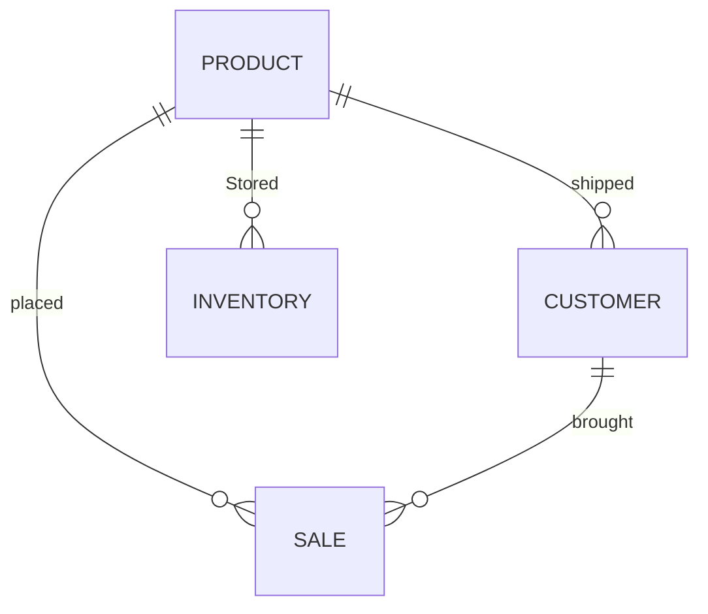

## **Nike Shoes**

### **Descripction**:
Products: Represents different models of Nike shoes sold in the store.  
Customers: Details about customers who purchase shoes.  
Sales: Transaction records linking customers and the products they buy.  
Inventory: Tracks the stock levels of various shoe models.  
