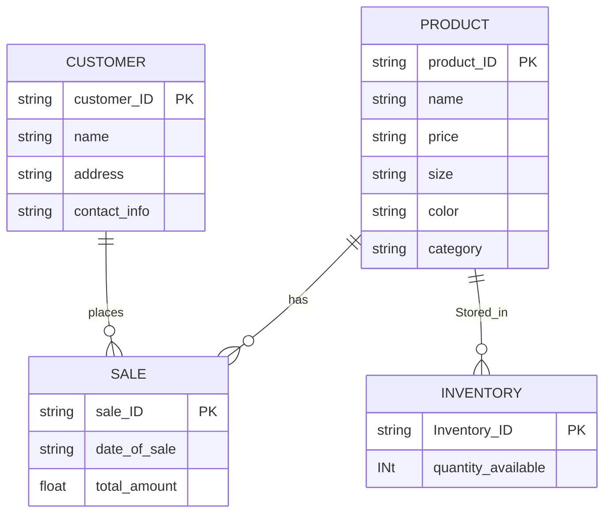

## **Nike Shoes**

### **Descripction**:

Product - Sales: A Product can be part of multiple Sales transactions, but each sale will involve one or more products. This is a Many-to-Many relationship, with an intermediary entity such as Sale_Line_Items (Sale_ID, Product_ID) if needed to handle multiple products in a sale.  
Sales - Customer: Each Sales transaction is associated with a Customer, creating a Many-to-One relationship (many sales can be linked to one customer).  
Product - Inventory: Each Product has an entry in Inventory that indicates how many units of that product are available. This is a One-to-One or One-to-Many relationship (one product can have one or multiple inventory entries, especially if there are different store locations).  

One Product can be part of many Sales transactions.
One Sale involves one or more Products.
One Customer can make many Sales .
One Product is linked to one Inventory record, although a store could have different quantities in various locations, so this may reflect a One-to-Many relationship between products and inventory locations
